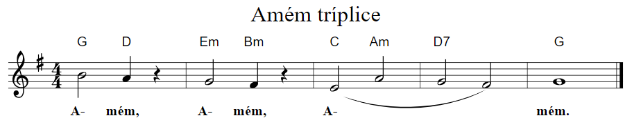

# Cifras do Novo Cântico
Há na internet um arquivo com as cifras dos hinos do **Novo Cântico** que, por vários anos, tem auxiliado a igreja no uso do hinário. Contudo, esse documento tem alguns problemas:

* diagramação inapropriada que causa a separação de versos e estrofes em colunas e páginas diferentes,
* posicionamento incorreto de acordes e
* acordes incorretos.

O propósito deste repositório é disponibilizar os hinos com cifras de uma forma estruturada e que facilite a correção dos problemas citados. O resultado pode ser visto [nesta página](https://savioa.github.io/cifras-novo-cantico/). Nela, cada hino disponível pode ser visto em formato de cifra simples ou de partitura com cifra (que permite transposição).

As referências usadas são o próprio [Hinário Novo Cântico com partituras](https://www.editoraculturacrista.com.br/hinario-novo-cantico-com-partitura-sem-cifras.html) e um conjunto de cadernos que a [Editora Cultura Cristã](https://www.editoraculturacrista.com.br/) publicou a partir de 2003 com “pautas dos hinos com melodias e cifras facilitadas para acompanhamento”.

Os hinos são armazenados em arquivos com a [notação ABC](http://abcnotation.com/) e em arquivos de texto simples.

## ABC



```
X:400A
T:Amém tríplice
M:4/4
L:1/4
K:G
"G" B2 "D" A z | "Em" G2 "Bm" F z | ("C" E2 "Am" A2 | "D7" G2 F2) | "G" G4 |]
w:A- mém, A- mém, A- ~ ~ ~ mém.
```

## Texto simples

```
400 A - Amém tríplice

G   D    Em   Bm   C Am D7   G
A - mém, A_ - mém, A______ - mém.
```

# Colaboração

Você pode participar deste projeto [relatando erros e sugerindo funcionalidades](https://github.com/savioa/cifras-novo-cantico/issues).